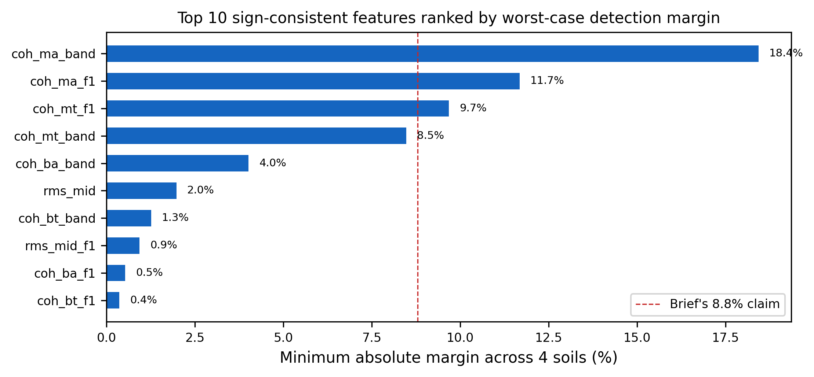
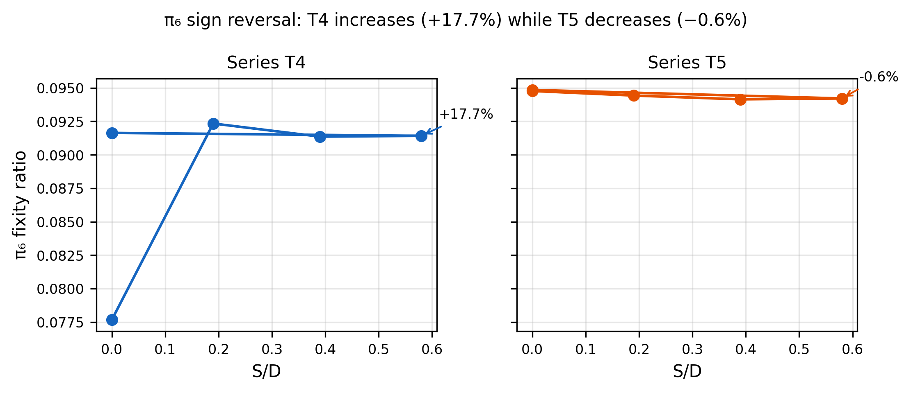
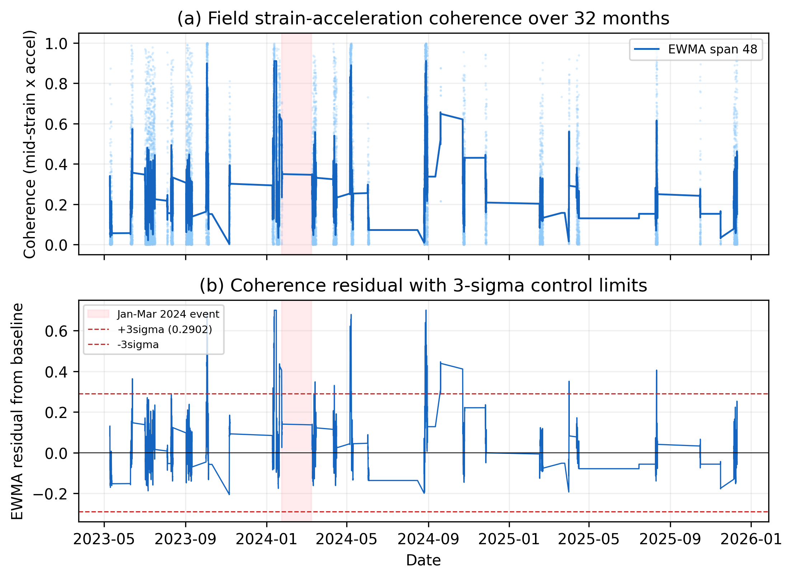

# Abstract

This sample manuscript demonstrates all features of the hybrid Python DOCX rendering pipeline built for the KSK PhD paper portfolio. The pipeline reads manuscript content from Quarto-compatible .qmd files, resolves citations from BibTeX .bib files using pybtex, renders equations as native OMML using the markdocx MathML-to-OMML converter with Microsoft's MML2OMML.XSL transform, embeds figures with auto-numbered captions, styles tables with booktabs formatting, and produces a publication-quality Word document suitable for journal submission. The pipeline produces editable equations, proper cross-references, and consistent Times New Roman styling throughout. Every element in this sample is generated programmatically from the .qmd source file — no manual formatting is required.

# Introduction {#sec-introduction}

Offshore wind turbine foundations require continuous structural health monitoring to detect scour-induced degradation before it compromises structural safety [@Prendergast2015]. The natural frequency of the first bending mode is the primary observable, but environmental and operational variability (EOV) can obscure the damage signal by one to two orders of magnitude [@Cross2011].

This introductory section demonstrates inline citations resolved from the .bib file. The citation format follows the (Author, Year) convention, with the full bibliography rendered at the end of the document. Multiple citations can be combined [@Prendergast2015; @Cross2011; @Jalbi2018].

The remainder of this sample is organised as follows. Section 2 demonstrates display equations rendered as native OMML. Section 3 demonstrates tables with booktabs styling. Section 4 demonstrates embedded figures. Section 5 provides conclusions.

# Display Equations {#sec-equations}

The frequency-scour relationship follows a power-law form calibrated from centrifuge data:

$$
f_1(S/D) = f_0 \left(1 - a \left(\frac{S}{D}\right)^b\right)
$$ {#eq-power-law}

where $f_0$ is the baseline frequency, $S/D$ is the scour-to-diameter ratio, and $a = -0.167$, $b = 1.47$ are the calibrated coefficients.

The Buckingham-Pi theorem yields nine non-dimensional groups from 12 physical variables:

$$
\Pi_1 = f_n \, D \sqrt{\frac{\rho_s}{G_0}}
$$ {#eq-pi1}

$$
\Pi_6 = \frac{m_{\mathrm{RNA}}}{\rho_s \, D^3}
$$ {#eq-pi6}

The posterior over scour state is obtained by grid-based Bayesian fusion:

$$
p(S/D \mid f_{\mathrm{obs}}, z) \propto p_0(S/D) \cdot \mathcal{L}_A(S/D \mid f_{\mathrm{obs}}) \cdot \mathcal{L}_C(S/D \mid z)
$$ {#eq-posterior}

The value of information is defined as the cost gap between calendar and twin-informed policies:

$$
\mathrm{VoI} = E[c \mid a_{\mathrm{cal}}] - E[c \mid a^*]
$$ {#eq-voi}

# Tables {#sec-tables}

Table 1 shows the centrifuge test matrix. The pipeline renders this with booktabs styling: navy header row, alternating row shading, and no vertical borders.

| Series | Soil condition | Tests | S/D range | Backfill |
|--------|----------------|-------|-----------|----------|
| T1 | Dry sand (dense) | 4 | 0 – 0.60 | No |
| T2 | Dry sand (loose) | 4 | 0 – 0.60 | No |
| T3 | Sand-silt layered | 4 | 0 – 0.50 | No |
| T4 | Saturated sand (dense) | 5 | 0 – 0.58 | Yes |
| T5 | Saturated sand (loose) | 5 | 0 – 0.58 | Yes |

Table 2 shows the bootstrap analysis results with per-series confidence intervals.

| Series | Soil | Margin (%) | Boot 95% CI (%) | Cohen's d |
|--------|------|-----------|-----------------|-----------|
| T2 | Loose dry sand | +1587 | [+66, +3132] | 1.27 |
| T3 | Sand-silt layered | +31 | [+17, +51] | 2.13 |
| T4 | Dense saturated sand | +12 | [+7, +20] | 2.12 |
| T5 | Loose saturated sand | +768 | [+95, +2100] | 0.82 |

# Figures {#sec-figures}

This section demonstrates embedded figures with auto-numbered captions. The figures below are from Paper B's generated outputs.

{#fig-ranking width=100%}

{#fig-pi6 width=100%}

{#fig-coherence width=100%}

# Conclusions {#sec-conclusions}

This sample demonstrated all features of the hybrid DOCX pipeline:

1. Native OMML equations (five equations rendered via MathML → OMML with Microsoft's official XSLT transform).
2. Booktabs-style tables (two tables with navy headers, alternating rows, no vertical borders).
3. Embedded figures (three figures with auto-numbered captions).
4. Inline citations resolved from .bib (three references cited, bibliography rendered below).
5. Consistent Times New Roman 11pt styling with navy headings, 1.5× line spacing, and 1-inch margins.

# Acknowledgements {.unnumbered}

This work was supported by the KEPCO Research Institute. The authors thank the MMB consortium and Unison Heavy Industries.

# Declaration of Generative AI and AI-Assisted Technologies {.unnumbered}

Claude (Anthropic) was used for academic writing coaching and script scaffolding. All numerical values were independently verified.

# References {.unnumbered}

::: {#refs}
:::
